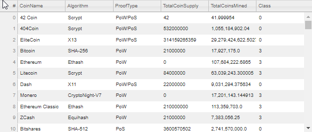
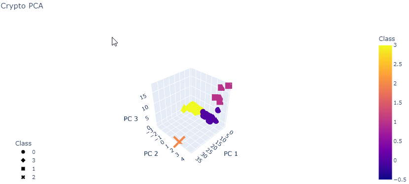
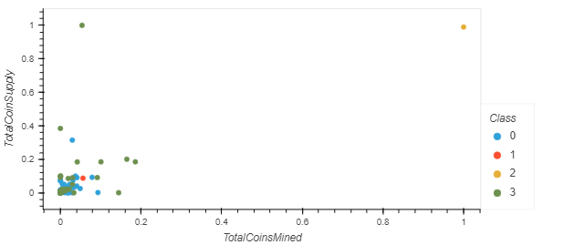

# Cryptocurrencies

## Project Overview
The purpose of this project was to analyze a database of cryptocurrencies using unsupervised machine learning to create a report of traded coins according to their different features. The analysis is focused on offering a new cryptocurrency investment portfolio for a bank's customers.

## Results
The cryptocurrency database had 1232 crypto coins, though only 532 of them were tradable.

Tradable Cryptocurrencies 
 

3D Scatter Plot
 

2D hvPlot
 

## Summary
From the graphs above, it was found that most tradable cryptocurrencies were either parts of class 0 or 3. Five cryptocurrencies were part of class 1 and only one was part of class 2. For an investment portfolio, these cryptocurrencies that are parts of class 1 or 2 may be more risky and therefore may not be the best to be included. However, a further analysis should be carried out to determine the customer interest in cryptocurrencies that have less similar features than their other cryptocurrency counterparts.
